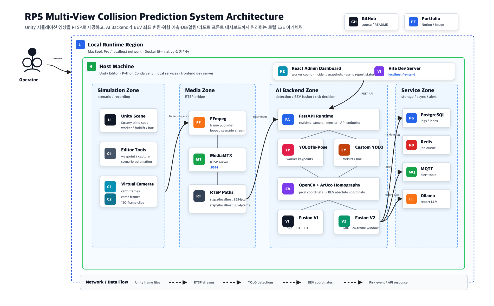
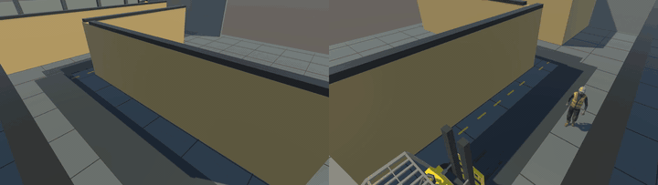
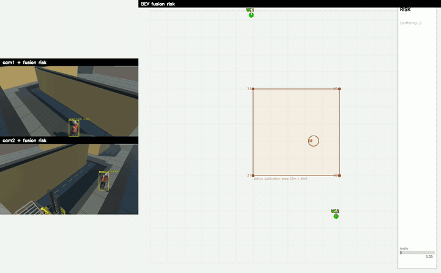
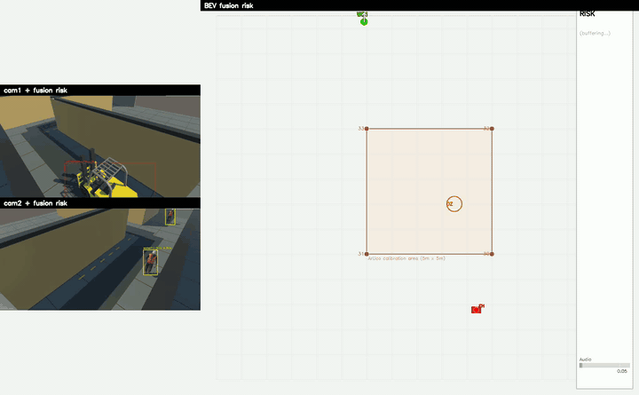
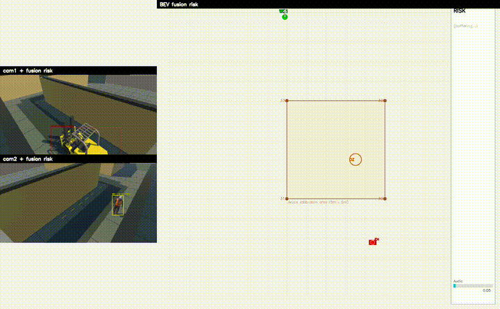
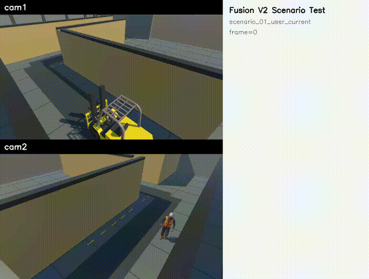

# RPS: Multi-View Risk Prediction System

Unity 기반 공장 사각지대 시뮬레이션에서 cam1 / cam2 영상을 생성하고, RTSP 입력처럼 백엔드에 주입한 뒤 작업자, 지게차, 인양물 DropZone의 절대좌표를 계산해 충돌 위험을 예측하는 AI 안전 모니터링 시스템입니다.

단순히 객체를 검출하는 데서 끝나지 않고, 서로 다른 카메라에서 검출된 객체를 ArUco Homography 기반 BEV 좌표계로 통합하고, Warning / Danger 판단, PostgreSQL 사고 로그 저장, 작업자별 위험 카운트, Redis 기반 비동기 리포트 생성, React 관리자 대시보드까지 연결한 E2E 프로젝트입니다.

## Project Summary

| 항목 | 내용 |
| --- | --- |
| 프로젝트명 | RPS: Multi-View Risk Prediction System |
| 한 줄 설명 | 멀티뷰 RTSP 영상 기반 지게차-작업자-인양물 충돌 위험 예측 시스템 |
| 개발 인원 | 1명 |
| 핵심 역할 | Unity 시뮬레이션, RTSP 브릿지, YOLO/Pose 추론, Homography 좌표 변환, Fusion V1/V2 위험 예측, FastAPI 백엔드, PostgreSQL 인덱싱, Redis 비동기 리포트, React 대시보드 |
| 주요 성과 | 추론 성능 `3.145 FPS -> 10.148 FPS`, frame 처리시간 `0.320s -> 0.099s`, Fusion V2 F1 `99.210%`, PostgreSQL 날짜 검색 p50 `0.097ms` |

## Tech Stack

| 영역 | 기술 |
| --- | --- |
| Simulation | Unity, C# Editor Tooling |
| Streaming | FFmpeg, MediaMTX, RTSP |
| Computer Vision | OpenCV, ArUco Marker, Homography, Ultralytics YOLO, YOLO-Pose |
| AI / Fusion | PyTorch, GRU, MLP, Sliding Window, rule-based Fusion V1 |
| Backend | FastAPI, Uvicorn, SQLAlchemy Async, asyncpg |
| Async / Report | Redis Queue, Background Worker, Ollama, Qwen3 |
| Database / Search | PostgreSQL, B-tree Composite Index, Elasticsearch 비교 실험 |
| Frontend | React, Vite, TypeScript, Recharts, jsPDF, html-to-image |

## System Architecture

아래 구조는 실제 CCTV RTSP 입력을 가정하되, 포트폴리오 검증 환경에서는 Unity에서 녹화한 cam1 / cam2 영상을 FFmpeg와 MediaMTX를 통해 RTSP 스트림으로 제공하도록 구성했습니다.



핵심 흐름은 다음과 같습니다.

```text
Unity Simulation
  -> FFmpeg Publisher
  -> MediaMTX RTSP Server
  -> Backend Server
      -> RTSP Stream Reader
      -> YOLO-Pose / Custom YOLO
      -> ArUco Homography
      -> Fusion V1 / Fusion V2
      -> PostgreSQL / MQTT / Redis Report Job
  -> React Admin Dashboard
```

역할을 분리하면 다음과 같습니다.

| 구성 요소 | 역할 |
| --- | --- |
| Unity Simulation | 사각지대, T자형 동선, 지게차, 작업자, 인양물 DropZone 시나리오 생성 |
| FFmpeg | 녹화된 cam1 / cam2 프레임을 RTSP 스트림으로 publish |
| MediaMTX | `rtsp://localhost:8554/cam1`, `rtsp://localhost:8554/cam2` 주소 제공 |
| Backend Server | RTSP 수신, 프레임 추론, 좌표 변환, 위험 판단, 로그 저장 |
| Uvicorn + FastAPI | 관리자 API, 사고 로그 조회, 작업자 통계, 리포트 생성 요청 처리 |
| PostgreSQL | 사고 로그, 작업자, 리포트 데이터 저장 |
| Redis Queue | 오래 걸리는 LLM 리포트 생성을 API 응답 흐름에서 분리 |
| Ollama / Qwen3 | 날짜별 사고 로그 기반 안전 리포트 생성 |
| React Dashboard | 작업자별 위험 카운트, 사고 snapshot, 리포트 조회 화면 제공 |

## End-to-End Flow

1. Unity에서 공장 사각지대 충돌 시나리오를 만들고 cam1 / cam2 영상을 녹화합니다.
2. FFmpeg가 녹화 프레임을 MediaMTX RTSP 서버에 publish합니다.
3. Backend Server가 RTSP 스트림에서 cam1 / cam2 프레임을 읽습니다.
4. YOLO-Pose로 작업자 keypoint를 검출하고, Custom YOLO로 지게차와 인양물을 검출합니다.
5. 검출된 픽셀 좌표를 ArUco Homography로 BEV 절대좌표로 변환합니다.
6. Fusion V1 또는 Fusion V2가 작업자, 지게차, 지게차 전방 FH 기준점, DropZone의 위험도를 계산합니다.
7. 위험도가 기준을 넘으면 Warning / Danger 이벤트를 생성합니다.
8. snapshot과 사고 로그를 PostgreSQL에 저장하고, 필요 시 MQTT 알림을 발행합니다.
9. React 관리자 화면은 FastAPI를 통해 작업자별 위험 count, 사고 로그, 리포트를 조회합니다.
10. 리포트 생성 요청은 Redis Queue에 등록되고, Report Worker가 Ollama를 호출해 결과를 PostgreSQL에 저장합니다.

## Vision And Fusion Pipeline


### Detection

| 모델 | 역할 | 사용 이유 |
| --- | --- | --- |
| YOLO-Pose | 작업자 검출 및 발목/하체 기준 위치 추정 | 사람의 bbox 중심보다 실제 바닥 접점에 가까운 좌표가 필요했기 때문 |
| Custom YOLO | 지게차, box / DropZone 관련 객체 검출 | Unity 환경의 지게차와 인양물 형태가 일반 COCO 객체와 달라 별도 학습이 필요했기 때문 |

### Coordinate Transform

카메라별 픽셀 좌표는 그대로 비교할 수 없기 때문에, ArUco Marker를 기준으로 Homography를 생성해 모든 객체를 동일한 BEV 절대좌표계로 변환했습니다.

```text
cam1 pixel coordinate
cam2 pixel coordinate
        |
        v
ArUco Homography
        |
        v
BEV absolute coordinate
```

### Fusion V1

Fusion V1은 딥러닝 모델이 아니라 규칙 기반 위험 판단 로직입니다. 작업자와 지게차의 거리, 속도, 진행 방향, TTC, 지게차 전방 FH 기준점, DropZone 반경을 이용해 Warning / Danger를 계산합니다.

```text
BEV coordinates
  -> distance / velocity / TTC / FH point
  -> rule-based score
  -> SAFE / WARNING / DANGER
```

### Fusion V2

Fusion V2는 최근 24프레임의 좌표 feature sequence를 입력받는 GRU 기반 위험 예측 모델입니다. 프레임마다 생성된 23차원 feature vector를 24개 누적해 하나의 sliding window로 만들고, GRU와 MLP Head를 거쳐 지게차 충돌 위험과 DropZone 위험 확률을 반환합니다.

```text
24-frame window
  -> Normalize
  -> Linear(23 -> 96)
  -> GRU(2-layer, hidden=96)
  -> MLP Head(96 -> 48 -> 2)
  -> Sigmoid
  -> forklift_prob, dropzone_prob
```

| 점수 범위 | 결과 |
| --- | --- |
| `score < 0.4` | SAFE |
| `0.4 <= score < 0.8` | WARNING |
| `0.8 <= score` | DANGER |

## Demo

최종 검증은 Unity에서 만든 3개의 지게차-작업자 시나리오와 1개의 인양물 DropZone 시나리오로 진행했습니다. 아래 GIF는 GitHub README에서 바로 확인할 수 있도록 원본 mp4를 압축한 결과입니다.

| 시나리오 | 검증용 입력 | 모델 적용 결과 |
| --- | --- | --- |
| Scenario 01<br>사용자 커스텀 배치 기반 충돌 위험 |  |  |
| Scenario 02<br>작업자/지게차 위치 반대 구도 |  |  |
| Scenario 03<br>반대 방향 접근 구도 |  |  |

### Fusion V1 / V2 Comparison

| 모델 | 결과 GIF | 설명 |
| --- | --- | --- |
| Fusion V1 |  | 거리, TTC, FH 기준점, DropZone 조건을 조합해 위험을 판단하는 규칙 기반 방식 |
| Fusion V2 |  | 최근 24프레임의 BEV 좌표 시계열을 학습해 위험 확률을 예측하는 GRU 기반 방식 |

## Model Metrics

| Model | Accuracy | Precision | Recall | F1 |
| --- | ---: | ---: | ---: | ---: |
| Custom YOLO | 97.721% | 96.449% | 97.123% | 96.785% |
| YOLO-Pose worker detection | 98.333% | 100.000% | 99.167% | 99.582% |
| Fusion V1 overall | 92.188% | 93.499% | 82.287% | 84.927% |
| Fusion V2 combined danger | 99.696% | 99.119% | 99.301% | 99.210% |
| Fusion V2 forklift danger | 99.683% | 98.126% | 98.919% | 98.521% |
| Fusion V2 dropzone danger | 99.708% | 99.504% | 99.448% | 99.476% |

Fusion V2 학습 데이터는 실제 Unity 녹화 시나리오 7개와, SAFE / WARNING / DANGER 상황이 균형 있게 포함되도록 절대좌표 기반으로 절차적 생성한 synthetic 시나리오 450개를 결합해 구성했습니다. synthetic 데이터는 단순 무작위 좌표가 아니라, 충돌, 근접, DropZone 접근 패턴을 먼저 정의한 뒤 시작점과 이동 경로에 랜덤 변형을 적용해 생성했습니다.

상세 자료:

- [Fusion V2 README](model/fusion_v2/README.md)
- [Model metrics and fusion structure](assets/readme/model_metrics_and_fusion_structure.md)

## Performance Improvement

초기 구조는 cam1 pose, cam2 pose, custom YOLO, fusion 계산이 대부분 한 루프 안에서 순차 실행되어 평균 약 `3.145 FPS`, frame당 약 `0.320s` 수준이었습니다. 이후 카메라 단위 병렬 처리, 모델 단위 병렬 처리, 입력 이미지 크기 조정, pose skip/cache를 적용해 최대 약 `10.148 FPS`까지 개선했습니다.

최종 설정:

```bash
DETECTION_PARALLEL_MODE=model_parallel
POSE_IMGSZ=640
CUSTOM_IMGSZ=512
POSE_EVERY_N_FRAMES=2
```

| 단계 | 내용 | FPS | 직전 대비 FPS 향상 | 1 frame 처리시간 | 직전 대비 처리시간 감소 |
| --- | --- | ---: | ---: | ---: | ---: |
| 0 | 초기 serial 처리 | 3.145 FPS | - | 0.320s | - |
| 1 | 카메라별 병렬 처리 | 5.488 FPS | +74.5% | 0.183s | 43.0% 감소 |
| 2 | 모델별 병렬 처리 | 6.335 FPS | +15.4% | 0.158s | 13.5% 감소 |
| 3 | Custom YOLO 이미지 크기 `640 -> 512` | 7.364 FPS | +16.2% | 0.136s | 14.2% 감소 |
| 4 | Pose 2프레임 1회 추론 + cache 재사용 | 10.148 FPS | +37.8% | 0.099s | 27.0% 감소 |

최종적으로 초기 대비 FPS는 약 `222.7%` 향상되었고, frame 처리 시간은 약 `69.1%` 감소했습니다.

## Backend Improvements

### PostgreSQL Indexing

사고 로그가 늘어날수록 관리자 화면의 날짜별 조회 성능이 중요해졌습니다. Elasticsearch를 모든 검색에 적용하는 방식도 검토했지만, 날짜/작업자/위험유형처럼 구조화된 조건 조회는 PostgreSQL 복합 인덱스가 더 적합했습니다.

적용 인덱스:

```sql
CREATE INDEX CONCURRENTLY IF NOT EXISTS idx_incident_logs_date_created_id
ON incident_logs (date, created_at DESC, id DESC);

CREATE INDEX CONCURRENTLY IF NOT EXISTS idx_incident_logs_date_type_worker_created_id
ON incident_logs (date, incident_type, worker_id, created_at DESC, id DESC);
```

검증 조건:

| 항목 | 값 |
| --- | ---: |
| 전체 사고 로그 | 300,391건 |
| mock 데이터 | 300,000건 |
| 날짜 종류 | 1,000개 |
| 날짜별 데이터 | 약 300건 |
| 삽입 방식 | 날짜 순서가 아닌 랜덤 셔플 |

| 검색 유형 | 방식 | 평균 | p50 | p95 | 결론 |
| --- | --- | ---: | ---: | ---: | --- |
| 날짜 컬럼 필터 | PostgreSQL Index | 0.480ms | 0.097ms | 0.660ms | 구조화 날짜 검색에 가장 적합 |
| 날짜 컬럼 필터 | Elasticsearch Filter | 5.376ms | 4.528ms | 7.960ms | 날짜만 찾기에는 오버헤드가 큼 |
| snapshot_path 문자열 검색 | PostgreSQL ILIKE | 99.146ms | 97.764ms | 105.804ms | 전체 문자열 탐색 비용 큼 |
| snapshot_path 문자열 검색 | Elasticsearch | 13.200ms | 8.577ms | 23.024ms | 부분 문자열 검색에 유리 |

정리하면 날짜 기반 조회는 PostgreSQL 복합 인덱스로 처리하고, snapshot path나 키워드 기반 검색은 Elasticsearch read model을 사용하는 방식이 적합하다고 판단했습니다.

### Redis Background Job

리포트 생성 API는 Ollama 응답을 기다려야 하므로 요청 시간이 길어질 수 있습니다. 이를 해결하기 위해 Redis를 단순 캐시가 아니라 Background Job Queue로 활용했습니다.

```text
React
  -> POST /reports/generate-async
  -> FastAPI registers job in Redis
  -> immediate job_id response
  -> Report Worker consumes job
  -> Ollama generates report
  -> PostgreSQL stores report
  -> React polls /jobs/{job_id}
```

| 항목 | 개선 전 | 개선 후 | 개선 효과 |
| --- | ---: | ---: | ---: |
| 리포트 생성 API 응답 | Ollama 생성 완료까지 약 71초 대기 | Redis job 등록 후 즉시 `job_id` 반환 | 긴 작업을 API 응답 경로에서 분리 |
| 리포트 목록 응답 크기 | 97,761 bytes | 729 bytes | 약 99.25% 감소 |

## Main API

| Method | Path | 설명 |
| --- | --- | --- |
| GET | `/workers` | 작업자 목록 및 누적 위험 count |
| GET | `/incident-logs/summary?target_date=YYYY-MM-DD` | 날짜별 작업자 위험 요약 |
| GET | `/incident-logs/search/postgres` | PostgreSQL 기반 사고 로그 검색 |
| GET | `/incident-logs/search/elasticsearch` | Elasticsearch 기반 사고 로그 검색 |
| POST | `/incident-logs/with-snapshot` | snapshot 업로드 + 사고 로그 저장 |
| GET | `/images/serve?path=...` | 저장된 snapshot 이미지 서빙 |
| POST | `/reports/generate` | 동기 리포트 생성 |
| POST | `/reports/generate-async` | Redis background report job 생성 |
| GET | `/jobs/{job_id}` | background job 상태 조회 |
| GET | `/reports/summary` | 리포트 목록 경량 조회 |
| GET | `/reports/{report_id}` | 리포트 상세 HTML 조회 |

## Runbook

### 1. Environment

```bash
cd /Users/haechan/Desktop/pobiga/ai/ai_project
conda activate venv
```

### 2. Homography Calibration

```bash
python input/media/calibrate_homography.py --cam cam1 --image calibration/test_cam1.jpg
python input/media/calibrate_homography.py --cam cam2 --image calibration/test_cam2.jpg
```

### 3. RTSP Bridge

Terminal A:

```bash
mediamtx
```

Terminal B:

```bash
python input/media/tools/stream_collision_scenario_rtsp.py \
  --scenario scenario_01_user_current \
  --rtsp-base rtsp://localhost:8554
```

### 4. Realtime Fusion Pipeline

```bash
HEADLESS=1 \
CAMERA_RTSP_URL_1=rtsp://localhost:8554/cam1 \
CAMERA_RTSP_URL_2=rtsp://localhost:8554/cam2 \
FUSION_SERVER_URL=http://127.0.0.1:1122 \
MQTT_BROKER=127.0.0.1 \
LOCAL_SNAPSHOT_PATH=/Users/haechan/Desktop/pobiga/ai/ai_project/snapshots \
DETECTION_PARALLEL_MODE=model_parallel \
POSE_IMGSZ=640 \
CUSTOM_IMGSZ=512 \
POSE_EVERY_N_FRAMES=2 \
python -m model.fusion.runtime.realtime_camera \
  --no-audio \
  --no-prompt \
  --duration 60 \
  --run-label demo_run \
  --metrics-path metrics/demo_run.jsonl
```

### 5. FastAPI Backend

API만 확인할 때는 Fusion subprocess를 끄고 실행할 수 있습니다.

```bash
DISABLE_FUSION_SUBPROCESS=1 \
DISABLE_REDIS_JOBS=1 \
conda run -n venv uvicorn server.main:app --host 127.0.0.1 --port 1122
```

### 6. Frontend

```bash
cd frontend
npm install
npm run dev
```

Production build:

```bash
npm run build
```

## Verification

현재 구현 기준으로 다음 항목을 점검했습니다.

| 점검 항목 | 결과 |
| --- | --- |
| Python 정적 컴파일 | `conda run -n venv python -m compileall -q server input/media model/fusion/runtime` 통과 |
| Frontend production build | `npm run build` 통과 |
| FastAPI health | `GET /` 정상 응답 |
| Workers API | `GET /workers` 정상 응답, worker `1`, `2` 반환 |
| 날짜별 사고 요약 | `GET /incident-logs/summary?target_date=2026-05-26` 정상 응답 |
| 리포트 경량 목록 | `GET /reports/summary?limit=5` 정상 응답 |
| Snapshot serving | `GET /images/serve?...` -> `200 image/jpeg` 확인 |

로컬 검증 시점의 `2026-05-26` 사고 요약:

| 항목 | 값 |
| --- | ---: |
| 전체 로그 | 307 |
| Warning | 223 |
| Danger | 84 |
| Worker 1 | 73 |
| Worker 2 | 234 |

## Directory Map

```text
ai_project/
├── assets/readme/                 # README/포트폴리오 이미지, GIF
├── calibration/                   # cam1/cam2 homography, marker world coords
├── docs/                          # 실험/성능/이슈 문서
├── frontend/                      # React + Vite dashboard
├── input/media/                   # RTSP bridge, calibration, detection pipeline
├── metrics/                       # FPS/API/search benchmark 결과
├── model/fusion/runtime/          # Fusion V1 realtime runtime
├── model/fusion_v2/               # GRU 기반 Fusion V2
├── model/yolo/                    # custom YOLO weights and runs
├── server/                        # FastAPI backend, DB, jobs, report, search
├── simulation/                    # Unity project and recordings
└── snapshots/                     # 위험 상황 snapshot 저장소
```

## Known Limits

- worker `1`, `2`는 실제 사번/생체 식별이 아니라 시뮬레이션 기반 익명 작업자 ID입니다.
- Unity 녹화 영상은 실제 CCTV를 대체한 검증용 입력이며, 운영 환경에서는 CCTV RTSP 주소를 직접 연결하는 구조로 확장할 수 있습니다.
- Fusion V2는 BEV 좌표 시계열 기반 모델이므로, 앞단의 검출 품질과 Homography 정확도에 영향을 받습니다.
- mock 사고 로그 중 일부는 실제 snapshot 파일이 없을 수 있으므로, 프론트는 존재하는 이미지 파일만 렌더링합니다.
- Elasticsearch는 날짜 컬럼 필터의 대체재가 아니라 snapshot path / 키워드 / 부분 문자열 검색용 read model로 사용하는 것이 적합합니다.

## Portfolio Sentence

멀티뷰 RTSP 영상에서 작업자, 지게차, 인양물을 검출하고 ArUco Homography로 BEV 절대좌표를 통합한 뒤, 규칙 기반 Fusion V1과 GRU 기반 Fusion V2로 Warning / Danger 위험을 예측하며 PostgreSQL 로그 저장, Redis 비동기 리포트 생성, React 관리자 대시보드까지 연결한 백엔드 중심 AI 안전 모니터링 시스템입니다.
