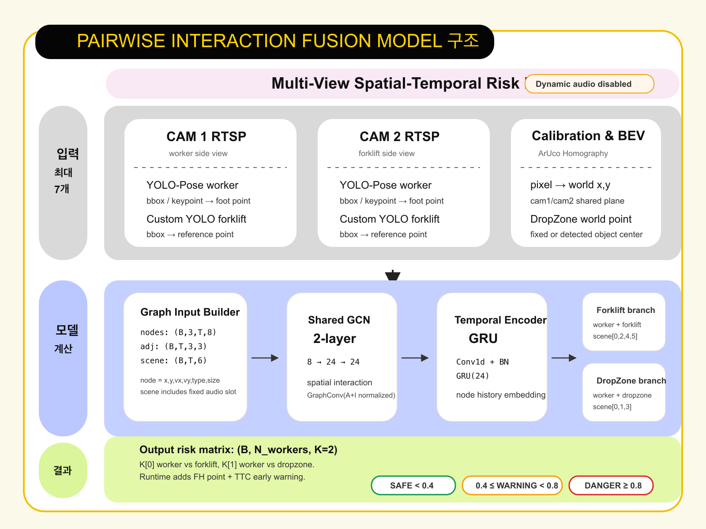

# Model Metrics and Fusion Structure

이 문서는 현재 프로젝트에서 실제로 사용 중인 모델 산출물 기준으로 성능 지표와 fusion 모델 구조를 정리한 자료입니다.

## Evaluation Basis

| Model | Current Artifact | Evaluation Source | Metric Interpretation |
| --- | --- | --- | --- |
| Custom YOLO | `model/yolo/best_forklift_box_colab.pt` | `/Users/haechan/Downloads/forklift_box_unity_color_result.zip` 내부 `forklift_box_unity_color-2/results.csv` | object detection은 일반 classification accuracy가 없으므로 `mAP50`을 Accuracy proxy로 사용 |
| YOLO-Pose | `yolo11s-pose.pt` | 최종 3개 시나리오의 `ground_truth.csv`와 `diagnostics/fusion/fusion_risk.csv` 비교 | 공식 COCO keypoint AP가 아니라, worker가 Pose -> Homography -> BEV/fusion 입력까지 유지됐는지 보는 operational metric |
| Fusion | `model/fusion/checkpoints/best_forklift.pt`, `model/fusion/checkpoints/best_dropzone.pt` | `model/fusion/training/summary.json` 및 synthetic validation split 재계산 | 3-class risk classification 기준: safe / warning / danger |

## Metric Summary

| Model | Accuracy | Precision | Recall | F1 | Notes |
| --- | ---: | ---: | ---: | ---: | --- |
| Custom YOLO `(forklift, box_1)` | 97.721% | 96.449% | 97.123% | 96.785% | Accuracy는 `mAP50(B)` proxy. `mAP50-95(B)`는 88.182% |
| YOLO-Pose worker detection | 98.333% | 100.000% | 99.167% | 99.582% | 3개 최종 시나리오, 360 frames, expected worker count 기준 |
| Fusion overall | 92.188% | 93.499% | 82.287% | 84.927% | forklift/dropzone dual model macro 평균 |

## Custom YOLO Detail

Source: `forklift_box_unity_color-2/results.csv`, epoch `80`

| Metric | Value |
| --- | ---: |
| Precision | 0.96449 |
| Recall | 0.97123 |
| F1 | 0.96785 |
| mAP50 | 0.97721 |
| mAP50-95 | 0.88182 |

Important: YOLO detection의 "정확도"는 classification accuracy처럼 전체 샘플 중 정답률을 바로 계산하지 않습니다. 그래서 포트폴리오에서는 `Accuracy(mAP50 proxy)`처럼 표기하는 것이 가장 안전합니다.

## YOLO-Pose Operational Detail

최종 시나리오에서 frame마다 실제 worker 수와 BEV/fusion 단계까지 살아남은 worker 수를 비교했습니다.

| Scenario | Frames | TP | FP | FN | Frame Count Accuracy | Precision | Recall | F1 |
| --- | ---: | ---: | ---: | ---: | ---: | ---: | ---: | ---: |
| `scenario_01_user_current` | 120 | 234 | 0 | 6 | 95.000% | 100.000% | 97.500% | 98.734% |
| `scenario_02_swapped_positions` | 120 | 240 | 0 | 0 | 100.000% | 100.000% | 100.000% | 100.000% |
| `scenario_03_opposite_worker` | 120 | 240 | 0 | 0 | 100.000% | 100.000% | 100.000% | 100.000% |
| Overall | 360 | 714 | 0 | 6 | 98.333% | 100.000% | 99.167% | 99.582% |

Important: 이 값은 pose model 자체의 keypoint 정확도(AP/OKS)가 아니라, 현재 시스템에서 작업자가 실제로 "위험 판단 입력"까지 정상적으로 들어왔는지 확인하는 운영 지표입니다.

## Fusion Detail

Fusion은 `DualPairModel` 구조입니다. forklift risk는 `best_forklift.pt`, dropzone risk는 `best_dropzone.pt`에서 각각 가져와 `(worker, threat)` pair별 risk matrix로 합칩니다.

| Fusion Target | Accuracy | Macro Precision | Macro Recall | Macro F1 | Support `(safe / warning / danger)` |
| --- | ---: | ---: | ---: | ---: | --- |
| Worker vs Forklift | 92.083% | 95.982% | 79.510% | 84.251% | `393 / 65 / 22` |
| Worker vs DropZone | 92.292% | 91.015% | 85.063% | 85.603% | `288 / 82 / 110` |
| Overall Average | 92.188% | 93.499% | 82.287% | 84.927% | - |

## Code-Accurate Fusion Structure

현재 코드 기준 fusion 입력은 동적 음성을 포함하지 않습니다. `scene` tensor에는 audio feature slot이 남아 있지만, 런타임에서는 `--no-audio` 모드로 사용하며 고정 score로 처리됩니다.

구조도:

핵심 코드 기준:

| Stage | Code Reference | Shape / Role |
| --- | --- | --- |
| Node features | `model/fusion/graph_input.py` | `(B, V=3, T, F_NODE=8)` |
| Scene features | `model/fusion/graph_input.py` | `(B, T, F_SCENE=6)` |
| GraphConv 1 | `model/fusion/model.py` | `8 -> 24` |
| GraphConv 2 | `model/fusion/model.py` | `24 -> 24` |
| Temporal encoder | `model/fusion/model.py` | `Conv1d + BatchNorm + ReLU + GRU(24)` |
| Forklift branch | `ThreatBranch(scene_in_dim=4)` | `audio_fixed, dist_w_f, fork_present, closing_w_f` |
| Dropzone branch | `ThreatBranch(scene_in_dim=3)` | `audio_fixed, crane_active, dist_w_dz` |
| Output | `PairwiseInteractionFusionModel.forward()` | `(B, N_workers, K=2)` |
| Runtime risk level | `model/fusion/risk_output.py` | Safe `<0.4`, Warning `0.4-0.8`, Danger `>=0.8` |
| Early warning | `model/fusion/runtime/early_warning.py` | TTC and closest-approach based escalation |
| Forklift reference | `model/fusion/runtime/kinematics.py` | Front Hazard point projected 1.0m ahead of forklift motion |
