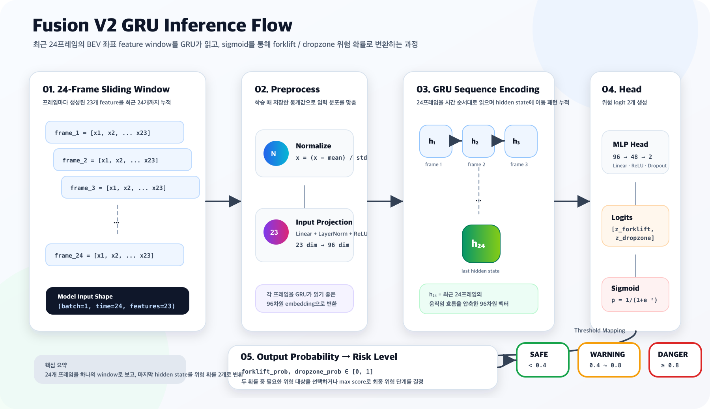

# Fusion V2 Details

Fusion V2는 기존 Fusion V1을 대체하지 않고, 독립적으로 추가한 딥러닝 위험 예측 모델입니다.

## V1 / V2 차이

| 항목 | Fusion V1 | Fusion V2 |
| --- | --- | --- |
| 방식 | 규칙 기반 | GRU 기반 시계열 딥러닝 |
| 입력 | 현재 프레임의 BEV 좌표, 거리, TTC, FH 기준점 | 최근 24프레임의 23차원 feature sequence |
| 판단 | 거리, TTC, DropZone 반경 등 사람이 정의한 조건 | 좌표 흐름을 학습해 forklift/dropzone 위험 확률 출력 |
| 장점 | 설명 가능하고 데이터가 적어도 동작 | 시간 흐름과 미래 위험 패턴을 학습 가능 |
| 역할 | 안정적인 baseline | V1 이후 확장 모델 |

## Model Structure

```text
24-frame window
  -> Normalize
  -> Linear(23 -> 96)
  -> GRU(2-layer, hidden=96)
  -> MLP Head(96 -> 48 -> 2)
  -> Sigmoid
  -> forklift_prob, dropzone_prob
```



| 구성 | 설명 |
| --- | --- |
| Window size | 최근 24프레임 |
| Feature dimension | 프레임당 23차원 |
| Linear input projection | 23차원 입력을 96차원 latent feature로 확장 |
| GRU | 24프레임의 움직임 패턴을 순차적으로 학습 |
| MLP Head | GRU hidden state를 위험 판단용 2개 logit으로 변환 |
| Sigmoid | logit을 0~1 확률로 변환 |
| Output | `[forklift_prob, dropzone_prob]` |

## Decision Threshold

| 점수 범위 | 결과 |
| --- | --- |
| `score < 0.4` | SAFE |
| `0.4 <= score < 0.8` | WARNING |
| `0.8 <= score` | DANGER |

## Dataset

최종 V2 학습 데이터는 실제 Unity 녹화 시나리오와 절대좌표 기반 synthetic 시나리오를 결합했습니다.

| 항목 | 값 |
| --- | ---: |
| 실제 Unity 녹화 시나리오 | 7개 |
| 절차적 synthetic 시나리오 | 450개 |
| 전체 시나리오 소스 | 457개 |
| 학습 window 수 | 89,176개 |
| Window size | 24 frames |
| Stride | 2 |
| Feature dimension | 23 |
| Augmentation | window당 noisy copy 1개 |
| Noise std | 0.02 |

Synthetic 데이터는 완전 무작위 좌표가 아니라, 충돌, 근접, DropZone 접근 패턴을 정의한 뒤 시작점과 이동 경로에 랜덤 변형을 적용해 생성했습니다.

## Geometry Future Label

최종 V2는 V1의 `forklift_risk`, `dropzone_risk`, `early_level` 값을 그대로 따라 하도록 학습하지 않았습니다. 절대좌표와 미래 horizon을 이용해 독립적으로 label을 만들었습니다.

| Target | Warning | Danger | Future Horizon |
| --- | ---: | ---: | ---: |
| Forklift | worker to forklift/FH <= 2.4m | <= 1.25m | next 12 frames |
| DropZone | worker to dropzone <= 2.8m | <= 2.0m | next 12 frames |

이 기준 때문에 현재 프레임에서 아직 닿지 않았더라도, 다음 12프레임 안에 위험 영역에 들어갈 것으로 보이면 Warning 또는 Danger label이 생성됩니다.

## Evaluation

| Target | Accuracy | Danger Precision | Danger Recall | Danger F1 |
| --- | ---: | ---: | ---: | ---: |
| Overall class | 99.41% | - | - | - |
| Forklift | 99.68% | 98.13% | 98.92% | 98.52% |
| DropZone | 99.71% | 99.50% | 99.45% | 99.48% |

## Scenario Review

| Scenario | Main Risk | Reference First Danger | V2 First Danger | Note |
| --- | --- | ---: | ---: | --- |
| `scenario_01_user_current` | W02 vs Forklift | frame 105 | frame 102 | V2 predicts slightly earlier. |
| `scenario_02_swapped_positions` | W01 vs Forklift | frame 23 | frame 23 | V2 matches the geometry reference. |
| `scenario_03_opposite_worker` | W02 vs Forklift | frame 99 | frame 96 | V2 predicts slightly earlier. |
| `scenario_04_box_dropzone` | W01 vs DropZone | frame 103 | frame 102 | Box/DropZone risk is detected. |
| `scenario_04_box_dropzone` | W02 vs DropZone | frame 33 | frame 31 | V2 predicts slightly earlier. |

## Data Archive

GitHub 50MB 권장 제한 때문에 `.npz` 학습 데이터는 일반 Git tracking 대상에서 제외하는 것이 좋습니다.

| 파일 | 보관 위치 | 설명 |
| --- | --- | --- |
| `fusion_v2_dataset.npz` | `benchmark/file/fusion_v2/` | V1 teacher label 기반 초기 V2 데이터 |
| `fusion_v2_geometry_future_dataset.npz` | `benchmark/file/fusion_v2/` | 최종 geometry future label 데이터 |

