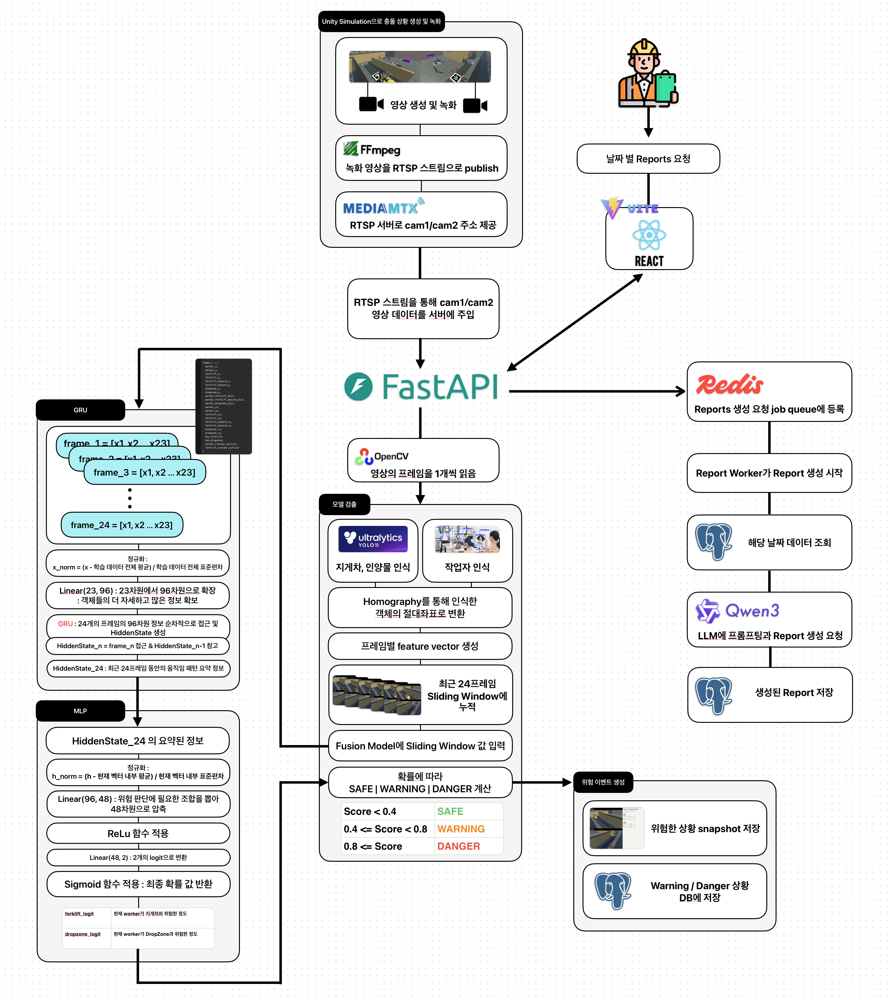
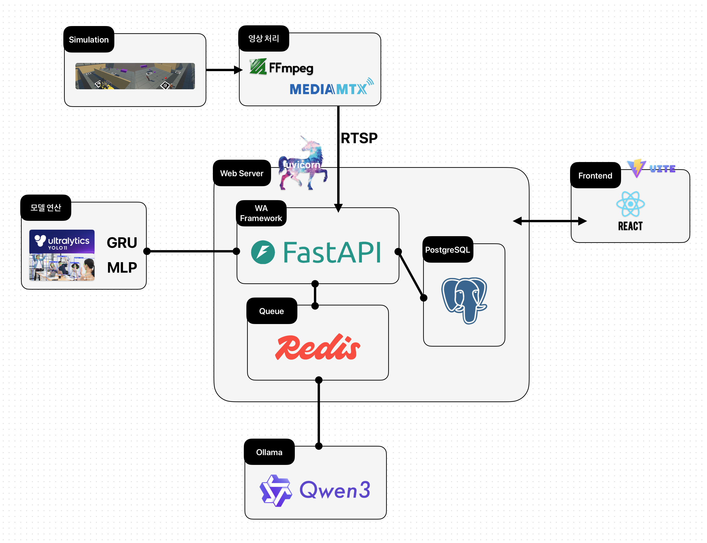
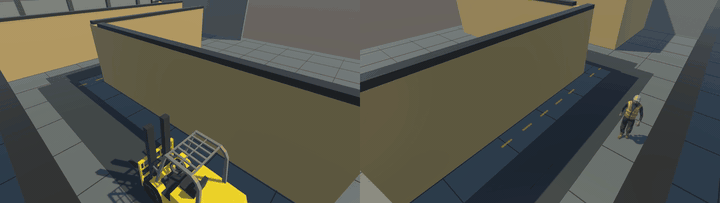

# RPS: Multi-View Risk Prediction System

Unity 기반 공장 사각지대 시뮬레이션에서 cam1 / cam2 영상을 생성하고, RTSP 입력처럼 백엔드에 주입한 뒤 작업자, 지게차, 인양물 DropZone의 절대좌표를 계산해 충돌 위험을 예측하는 AI 안전 모니터링 시스템입니다.

단순 객체 검출이 아니라 서로 다른 카메라에서 검출된 객체를 ArUco Homography 기반 BEV 좌표계로 통합하고, Warning / Danger 판단, PostgreSQL 사고 로그 저장, 작업자별 위험 카운트, Redis 기반 비동기 리포트 생성, React 관리자 대시보드까지 연결한 E2E 프로젝트입니다.

## Project Summary

| 항목 | 내용 |
| --- | --- |
| 프로젝트명 | RPS: Multi-View Risk Prediction System |
| 한 줄 설명 | 멀티뷰 RTSP 영상 기반 지게차-작업자-인양물 충돌 위험 예측 시스템 |
| 개발 인원 | 1명 |
| 핵심 역할 | Unity 시뮬레이션, RTSP 브릿지, YOLO/Pose 추론, Homography 좌표 변환, Fusion V1/V2 위험 예측, FastAPI 백엔드, PostgreSQL 인덱싱, Redis 비동기 리포트, React 대시보드 |
| 주요 성과 | 추론 성능 `3.145 FPS -> 10.148 FPS`, frame 처리시간 `0.320s -> 0.099s`, Fusion V2 F1 `99.210%`, PostgreSQL 날짜 검색 p50 `0.097ms` |

## Tech Stack

| 영역 | 기술 |
| --- | --- |
| Simulation | Unity, C# Editor Tooling |
| Streaming | FFmpeg, MediaMTX, RTSP |
| Computer Vision | OpenCV, ArUco Marker, Homography, Ultralytics YOLO, YOLO-Pose |
| AI / Fusion | PyTorch, GRU, MLP, Sliding Window, rule-based Fusion V1 |
| Backend | FastAPI, Uvicorn, SQLAlchemy Async, asyncpg |
| Async / Report | Redis Queue, Background Worker, Ollama, Qwen3 |
| Database / Search | PostgreSQL, B-tree Composite Index, Elasticsearch 비교 실험 |
| Frontend | React, Vite, TypeScript, Recharts, jsPDF, html-to-image |

## System Architecture

실제 운영에서는 CCTV RTSP 입력을 서버가 직접 읽는 구조를 가정합니다. 포트폴리오 검증 환경에서는 Unity에서 녹화한 cam1 / cam2 영상을 FFmpeg와 MediaMTX로 RTSP 스트림처럼 제공했습니다.

### Overall Architecture



### Detailed Processing Flow



```text
Unity Simulation
  -> FFmpeg Publisher
  -> MediaMTX RTSP Server
  -> FastAPI Backend
      -> RTSP Stream Reader
      -> YOLO-Pose / Custom YOLO
      -> ArUco Homography
      -> Fusion V1 / Fusion V2
      -> PostgreSQL / Redis Report Job
  -> React Admin Dashboard
```

## End-to-End Flow

1. Unity에서 공장 사각지대 충돌 시나리오를 만들고 cam1 / cam2 영상을 녹화합니다.
2. FFmpeg가 녹화 프레임을 MediaMTX RTSP 서버에 publish합니다.
3. Backend가 RTSP 스트림에서 cam1 / cam2 프레임을 읽습니다.
4. YOLO-Pose로 작업자 keypoint를 검출하고, Custom YOLO로 지게차와 인양물을 검출합니다.
5. 검출된 픽셀 좌표를 ArUco Homography로 BEV 절대좌표로 변환합니다.
6. Fusion V1 또는 Fusion V2가 작업자, 지게차, 지게차 전방 FH 기준점, DropZone의 위험도를 계산합니다.
7. 위험도가 기준을 넘으면 Warning / Danger 이벤트를 생성합니다.
8. snapshot과 사고 로그를 PostgreSQL에 저장하고, 관리자 화면에서 조회합니다.
9. 리포트 생성 요청은 Redis Queue에 등록되고, Report Worker가 Ollama를 호출해 결과를 PostgreSQL에 저장합니다.

## Vision And Fusion Pipeline


| 모델 | 역할 | 사용 이유 |
| --- | --- | --- |
| YOLO-Pose | 작업자 검출 및 발목/하체 기준 위치 추정 | 사람 bbox 중심보다 실제 바닥 접점에 가까운 좌표가 필요했기 때문 |
| Custom YOLO | 지게차, box / DropZone 관련 객체 검출 | Unity 환경의 지게차와 인양물 형태가 일반 COCO 객체와 달라 별도 학습이 필요했기 때문 |
| Fusion V1 | 거리, TTC, FH 기준점, DropZone 반경 기반 규칙 판단 | 적은 데이터에서도 설명 가능한 baseline 위험 판단이 필요했기 때문 |
| Fusion V2 | 최근 24프레임 좌표 시계열을 GRU/MLP로 학습 | V1 규칙 기반 한계를 줄이고, 시간 흐름 기반 위험 예측을 만들기 위함 |

## Demo

| 시나리오 | 검증용 입력 | 모델 적용 결과 |
| --- | --- | --- |
| Scenario 01<br>사용자 커스텀 배치 기반 충돌 위험 |  |  |
| Scenario 02<br>작업자/지게차 위치 반대 구도 |  |  |
| Scenario 03<br>반대 방향 접근 구도 |  |  |

## Fusion V1 / V2 Comparison

| 모델 | 결과 GIF | 설명 |
| --- | --- | --- |
| Fusion V1 |  | 거리, TTC, FH 기준점, DropZone 조건을 조합해 위험을 판단하는 규칙 기반 방식 |
| Fusion V2 |  | 최근 24프레임의 BEV 좌표 시계열을 학습해 위험 확률을 예측하는 GRU 기반 방식 |

## Model Metrics

| Model | Accuracy | Precision | Recall | F1 |
| --- | ---: | ---: | ---: | ---: |
| Custom YOLO | 97.721% | 96.449% | 97.123% | 96.785% |
| YOLO-Pose worker detection | 98.333% | 100.000% | 99.167% | 99.582% |
| Fusion V1 overall | 92.188% | 93.499% | 82.287% | 84.927% |
| Fusion V2 combined danger | 99.696% | 99.119% | 99.301% | 99.210% |
| Fusion V2 forklift danger | 99.683% | 98.126% | 98.919% | 98.521% |
| Fusion V2 dropzone danger | 99.708% | 99.504% | 99.448% | 99.476% |

## Performance Improvement

| 단계 | 내용 | FPS | 직전 대비 FPS 향상 | 1 frame 처리시간 | 직전 대비 처리시간 감소 |
| --- | --- | ---: | ---: | ---: | ---: |
| 0 | 초기 serial 처리 | 3.145 FPS | - | 0.320s | - |
| 1 | 카메라별 병렬 처리 | 5.488 FPS | +74.5% | 0.183s | 43.0% 감소 |
| 2 | 모델별 병렬 처리 | 6.335 FPS | +15.4% | 0.158s | 13.5% 감소 |
| 3 | Custom YOLO 이미지 크기 `640 -> 512` | 7.364 FPS | +16.2% | 0.136s | 14.2% 감소 |
| 4 | Pose 2프레임 1회 추론 + cache 재사용 | 10.148 FPS | +37.8% | 0.099s | 27.0% 감소 |

최종적으로 초기 대비 FPS는 약 `222.7%` 향상되었고, frame 처리 시간은 약 `69.1%` 감소했습니다.

## Backend Improvements

### PostgreSQL Indexing

사고 로그 300,391건 기준, 날짜 기반 조회는 Elasticsearch보다 PostgreSQL 복합 인덱스가 더 적합했습니다.

| 검색 유형 | 방식 | 평균 | p50 | p95 | 결론 |
| --- | --- | ---: | ---: | ---: | --- |
| 날짜 컬럼 필터 | PostgreSQL Index | 0.480ms | 0.097ms | 0.660ms | 구조화 날짜 검색에 가장 적합 |
| 날짜 컬럼 필터 | Elasticsearch Filter | 5.376ms | 4.528ms | 7.960ms | 날짜만 찾기에는 오버헤드가 큼 |
| snapshot_path 문자열 검색 | PostgreSQL ILIKE | 99.146ms | 97.764ms | 105.804ms | 전체 문자열 scan 비용 큼 |
| snapshot_path 문자열 검색 | Elasticsearch | 13.200ms | 8.577ms | 23.024ms | 부분 문자열 검색에 유리 |

### Redis Background Job

| 항목 | 개선 전 | 개선 후 | 개선 효과 |
| --- | ---: | ---: | --- |
| 리포트 생성 API 응답 | Ollama 생성 완료까지 약 71초 대기 | Redis job 등록 후 즉시 `job_id` 반환 | 긴 작업을 API 응답 경로에서 분리 |
| 리포트 목록 응답 크기 | 97,761 bytes | 729 bytes | 약 99.25% 감소 |

## Additional Docs

- [Performance Metrics](PERFORMANCE_METRICS.md)
- [Fusion V2 Details](FUSION_V2.md)
- [Upload Asset Manifest](steps/ASSET_MANIFEST.md)
